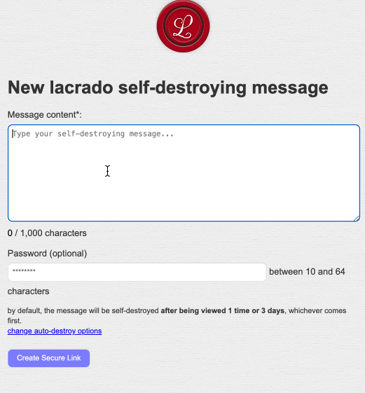

# Lacrado: share self-destroying messages



Lacrado is a simple web application that allows users to create messages that will be self destroyed after reaching a maximum number of views (1 by default) and after an expiration date (3 days).

A typical use case scenario would be to share a credential via email. Whereas if you send directly the credential, it is very probable that the receiver may forget to delete them from the Inbox. By sending link to the self-destroying message, this risk can be avoided (... and, yes, the receiver still can do crazy things such as copying the credentials into a text file kept in the Desktop...). 

Messaging tools such as Signal, WhatsApp or Telegram allow to send messages that are automatically deleted after being viewed. This is just an alternative.

## How does it work?

Lacrado is a Ruby on Rails application with client-side JavaScript that implements **zero-knowledge encryption**. This means the server never has access to the plain text content or encryption keys.

### Zero-Knowledge Encryption Flow

Let's say Bob wants to send an ephemeral self-destroying message to Alice:

#### 1. Creating a Message

1. **Bob writes the message** in his browser
2. **Optional**: Bob sets a secondary password (password2) for additional security
3. **Client-side encryption**:
   - Browser generates a random 16-character encryption key (password1)
   - Message is encrypted using AES-256-GCM with PBKDF2 key derivation (100,000 iterations)
   - Encryption uses password1 and password2 (if set)
4. **Sent to server**: Only the encrypted content, view limit, expiration time, and a boolean flag indicating if password2 was set
   - ⚠️ The server **never** receives the plain text, password1, or password2 on this process.
5. **Server stores**: Encrypted blob with metadata (views remaining, expiration time, password2_present flag)
6. **Browser constructs URL**: `https://lacrado.example.com/{message_id}#{password1}`
   - The `#{password1}` hash fragment is not shared with server in this process.
7. **Bob shares the link** with Alice

#### 2. Viewing a Message (non zero-knowledge)

1. **Alice opens the link**: `https://lacrado.example.com/{message_id}#{password1}`
   - ⚠️ Note: While the HTTP spec says hash fragments aren't sent to servers we've seen them appear. 
   To ensure the server never has all the data to decrypt the message there are two options:
    1. Share the link without password1
    2. Add password2.

3. **Server responds with**: Encrypted content and password2_present flag (no decryption keys)

4. **Client-side decryption**:
   - Browser reads password1 from the URL hash (`window.location.hash`)
   - If password2_present is true, prompts Alice for password2
   - Decrypts the message locally using password1 and password2
5. **Message displayed**: Alice sees the decrypted content

6. **View counter updated**: Browser notifies server to decrement views (no plain text sent)

7. **Auto-destruction**: If views reach zero, the message is permanently deleted from the database

### Short URLs (Without Password1)
As we mentioned `#password1`shared with the server.  Lacrado also supports short URLs without password1 in the hash: `https://lacrado.example.com/{message_id}`

When using short URLs:
- Alice must manually enter the password1 (16-character key)
- Bob shares password1 separately (e.g., via SMS, phone call)
- Zero-knowledge guarantees apply
- Useful for maximum security or when hash URLs are problematic

### Security Features

- **Zero-Knowledge**: Using short URLs and/or password2, the server does not have the keys to decrypt the message.
- **Client-side encryption/decryption**: All cryptographic operations happen in the browser
- **Web Crypto API**: Uses browser-native AES-256-GCM encryption
- **Strong key derivation**: PBKDF2 with 100,000 iterations (16 character key)
- **URL hash for password1**: Never sent to server in HTTP requests
- **Optional password2**: Additional layer of security shared out-of-band
- **Self-destruction**: Messages auto-delete after view limit or expiration


## Development

```
git clone https://github.com/merlos/lacrado

cd lacrado/
```

Launch the service:

```
rails db:migrate
```

```
rails s
```

Open http://localhost:3000

### Tests

If a migration is updated during development
```sh
rails db:drop db:create db:migrate
```

### Deployment

    TODO 

### LICENSE

GPLv3 

